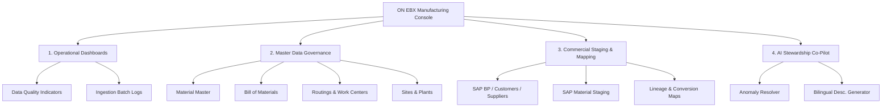

# TECHNICAL BLUEPRINT: ON EBX MANUFACTURING ACCELERATOR PERSPECTIVE

This document provides the definitive architectural blueprint and functional layout for the custom **TIBCO EBX Perspective** tailored for the **ON EBX Manufacturing Accelerator**. 

This perspective is designed to unify canonical master data governance, raw commercial staging, data quality diagnostics, and AI-assisted stewardship into a seamless, high-performance, and persona-driven user experience.

---

## 🗺️ High-Level Perspective Map

The Manufacturing Perspective organizes operational control, ingestion monitoring, and master data governance into four dedicated navigation sections:



---

## 👥 1. Target Personas & Security Matrix

A modern enterprise perspective must adapt to user roles. The Manufacturing Perspective defines four custom profiles:

| Persona Profile | Primary Focus Area | EBX Permissions | Key User Interface Requirements |
| :--- | :--- | :--- | :--- |
| **Manufacturing Data Steward** | Canonical Master Data Governance | Read/Write/Approve on Canonical, Read on Staging | Multi-level BOM trees, side-by-side record comparison, golden record editors. |
| **Integration & Mapping Analyst** | Raw Ingestion & Source Mapping | Read/Write on Staging & Mappings, Read on Canonical | Ingestion batch execution dashboards, mapping exception lists, lineage trees. |
| **Quality & Compliance Inspector** | Inspection Lots & Central Blocks | Read/Write on Quality & Blocks, Read on Material | Active block indicators, certificate registers, audit trails of central block changes. |
| **Executive & Business Consumer** | Operational Reporting & Analytics | Read-Only (All Areas) | High-level data quality dashboards, CSV/Excel export shortcuts, conformed catalogs. |

---

## 🗂️ 2. Navigation Hierarchy & Menu Structure

The left-hand navigation menu of the perspective is configured using standard EBX menu groups and actions. Here is the structured layout:

### 🏠 Group A: Operational & Stewardship Dashboards
*   **Menu Item 1: Active Ingestion & Health Monitor**
    *   *Type*: Web component / Custom Dashboard.
    *   *Metrics*: Staged records count by source system, ingestion execution success rates, and real-time validation health alerts.
*   **Menu Item 2: Canonical Data Quality Board**
    *   *Type*: EBX Tile View / Dashboard.
    *   *Metrics*: Percent of complete materials, active central blocks count, and orphan BOM node alerts (BOMs without active materials).

### 🏭 Group B: Canonical Master Data Governance (MDG)
*   **Menu Item 3: Materials & Items**
    *   *Action*: View Table `/root/Material` inside dataset `MfgMaterialManagement` of dataspace `BMfgMaterialManagement`.
    *   *View*: Hierarchical view grouped by `MaterialGroup` and filtered by lifecycle status.
*   **Menu Item 4: Multi-Level Bills of Materials (BOM)**
    *   *Action*: View Table `/root/BomHeader` inside dataset `MfgBomManagement` of dataspace `BMfgBomManagement`.
    *   *View*: Recursive hierarchy tree linking `BomHeader` -> `BomComponent` -> `Material` dynamically.
*   **Menu Item 5: Production Routings & Work Centers**
    *   *Action*: View Table `/root/RoutingHeader` inside dataset `MfgRoutingWorkCenterManagement` of dataspace `BMfgRoutingWorkCenterManagement`.
    *   *View*: Sequential operational layout displaying tasks, standard times, and associated machinery.
*   **Menu Item 6: Manufacturing Sites & Plants**
    *   *Action*: View Table `/root/Plant` inside dataset `MfgSitePlantReference` of dataspace `BMfgSitePlantReference`.
    *   *View*: Geographical grid view mapping plants, logistics zones, and storage locations.

### 📥 Group C: Commercial Sources Staging & Lineage
*   **Menu Item 7: SAP Business Partners & Directory**
    *   *Action*: View Table `/root/SapBusinessPartner` inside dataset `SapBusinessPartnerSource` of dataspace `SapBusinessPartnerSource`.
    *   *View*: Segmented by customer views (`SapCustomer`) and vendor views (`SapSupplier`).
*   **Menu Item 8: SAP Material Master Staging**
    *   *Action*: View Table `/root/SapMaterial` inside dataset `SapMaterialSource` of dataspace `SapMaterialSource`.
    *   *View*: Aligned strictly to SAP S/4HANA structures (`MARA`, `MARC`, `MARD`, `MVKE`).
*   **Menu Item 9: Reference Code Catalog (Customizing)**
    *   *Action*: View Table `/root/SapPlant` inside dataset `SapReferenceSource` of dataspace `SapReferenceSource`.
    *   *View*: Grouped list of customizing codes (Country, Language, MRP Types, UOMs).
*   **Menu Item 10: Staging Conversion & Lineage Mapping**
    *   *Action*: View Table `/root/SourceToCanonicalRecordMapping` inside dataset `CommercialSourceMapping` of dataspace `CommercialSourceMapping`.
    *   *View*: Lineage grid showing source keys, mapped target codes, matching confidence scores, and promotion approval statuses.

### 🤖 Group D: AI Stewardship Co-Pilot (Advanced Integrations)
*   **Menu Item 11: Automated Anomaly Resolver**
    *   *Action*: Custom User Service.
    *   *Description*: Lists staging records flagged with low confidence matching scores, allowing AI-proposed mappings to be accepted in bulk.
*   **Menu Item 12: Bilingual Description Generator**
    *   *Action*: Custom User Service.
    *   *Description*: Auto-translates raw SAP German or English technical descriptions into clean business labels in French (`fr-FR`) and English (`en-US`) using the AI assistant.

---

## 🎨 3. UI Aesthetics & Premium Ergonomics

To deliver an elite, visually stunning interface in line with the **ON EBX design language**, the perspective implements these premium visual guidelines:

1.  **Glassmorphism & SLEEK Themes**:
    *   Utilizes HSL tailored color schemes: Dark Charcoal background (`#121214`) for dark mode elements with high-transparency overlay blocks.
    *   Active/Hover states use vibrant Electric Teal (`#00E5FF`) and Sleek Violet (`#8E24AA`) gradients to give high interactive visual cues.
2.  **Harmonious Typography**:
    *   Defaulting browser styles to premium Google Fonts: **Outfit** for headers/tiles and **Inter** for data grids, improving readability.
3.  **Dynamic Micro-Animations**:
    *   Hover effects on navigation icons (3px slide-right transition on left-hand menu items).
    *   Smooth fade-in layouts for table loading spinners and progress bar components.
4.  **Bilingual Localized Prompts**:
    *   100% of the UI components, menus, lists, and tooltips are localized dynamically in `en-US` (English) and `fr-FR` (French).

---

## ⚙️ 4. Functional Capabilities & Core Achievable Goals

By implementing this structured perspective, the manufacturing team can achieve the following operational capabilities:

### A. Closed-Loop Ingestion & Lineage Tracing
Upstream ERP integrations push raw data into isolated staging tables (e.g., SAP `MARA` staged inside `SapMaterialSource`). The perspective allows an analyst to trace how a raw record propagates:
```text
[Raw SAP MARC entry] ──> [Mapped Reference Codes] ──> [AI Mapping Approval] ──> [Canonical Material]
```

### B. Automated Cross-Dataspace Constraints
By utilizing the explicitly conformed `<branch>` configurations we introduced:
- Referencing values like plant codes, countries, or units of measure inside raw staging tables will dynamically validate against `SapReferenceSource` or `MfgCommercialSourceReference` without any cross-dataspace loading blockages.

### C. Proactive Data Quality Alerts (DQIs)
Steer data governance using high-priority perspective badges:
*   **Badges**: Dynamic counters on menu items (e.g., displaying `[15]` next to **Automated Anomaly Resolver** when there are 15 unmapped staging records).

---

## 💎 Industry Standard Implementation Recommendations

To ensure maximum scalability and maintainability of the perspective configuration, implement these three practices:

1.  **Leverage EBX Custom User Services (Java Web Components)**:
    *   Implement AI-assisted actions using EBX Custom User Services built on React or Vue, communicating with the `ebx-ps-openai` module via REST to fetch recommendations without leaving the data grid.
2.  **Separate Staging and Canonical Life Cycles**:
    *   Keep transactional data lifecycles short: automatically purge or archive records in `Sap*Source` dataspaces once promoted to canonical master tables (`Material`, `BomHeader`) to maintain blazing-fast database index performance.
3.  **Role-Based Menu Filtering (Dynamic Perspective Views)**:
    *   Use EBX Profile Permissions to dynamically hide administrative menu groups (like the `AI Stewardship Co-Pilot` or `Lineage Mappings`) for standard executive users. This guarantees a clean, un-cluttered workspace tailored strictly to each user's primary responsibilities.


# APPENDIX: COMPLETE DATA CATALOG (DATASPACES, DATASETS, AND TABLES)

This appendix lists each and every staging and canonical table configured within the **ON EBX Manufacturing Accelerator**, along with its deployment path, home dataset, and branch (dataspace).

## 📥 1. Commercial Source Staging Layer
These schemas are deployed under `/WEB-INF/ebx/schemas/sources/` and isolate raw, source-aligned system records.

### 📦 Dataset: `CommercialSourceMapping`
*   **Dataspace (Branch)**: `CommercialSourceMapping`
*   **Schema Deployment Path**: `manufacturing-web/src/main/webapp/WEB-INF/ebx/schemas/sources/CommercialSourceMapping.xsd`
*   **Total Staging Tables**: 11

| Table Name | Table Path | Description |
| :--- | :--- | :--- |
| `SourceMappingApproval` | `/root/SourceMappingApproval` | Source staging table for `SourceMappingApproval` |
| `SourceMappingException` | `/root/SourceMappingException` | Source staging table for `SourceMappingException` |
| `SourceMappingExecutionLog` | `/root/SourceMappingExecutionLog` | Source staging table for `SourceMappingExecutionLog` |
| `SourceMappingLoadBatch` | `/root/SourceMappingLoadBatch` | Source staging table for `SourceMappingLoadBatch` |
| `SourceToCanonicalDatasetMapping` | `/root/SourceToCanonicalDatasetMapping` | Source staging table for `SourceToCanonicalDatasetMapping` |
| `SourceToCanonicalFieldMapping` | `/root/SourceToCanonicalFieldMapping` | Source staging table for `SourceToCanonicalFieldMapping` |
| `SourceToCanonicalRecordMapping` | `/root/SourceToCanonicalRecordMapping` | Source staging table for `SourceToCanonicalRecordMapping` |
| `SourceToCanonicalTableMapping` | `/root/SourceToCanonicalTableMapping` | Source staging table for `SourceToCanonicalTableMapping` |
| `SourceToCanonicalValueMapping` | `/root/SourceToCanonicalValueMapping` | Source staging table for `SourceToCanonicalValueMapping` |
| `SourceTransformationRule` | `/root/SourceTransformationRule` | Source staging table for `SourceTransformationRule` |
| `SourceValidationIssue` | `/root/SourceValidationIssue` | Source staging table for `SourceValidationIssue` |

---

### 📦 Dataset: `MfgCommercialSourceReference`
*   **Dataspace (Branch)**: `BMfgCommercialSourceReference`
*   **Schema Deployment Path**: `manufacturing-web/src/main/webapp/WEB-INF/ebx/schemas/sources/MfgCommercialSourceReference.xsd`
*   **Total Staging Tables**: 15

| Table Name | Table Path | Description |
| :--- | :--- | :--- |
| `CommercialSourceAttributeRole` | `/root/CommercialSourceAttributeRole` | Source staging table for `CommercialSourceAttributeRole` |
| `CommercialSourceBatch` | `/root/CommercialSourceBatch` | Source staging table for `CommercialSourceBatch` |
| `CommercialSourceBatchLog` | `/root/CommercialSourceBatchLog` | Source staging table for `CommercialSourceBatchLog` |
| `CommercialSourceConfidenceLevel` | `/root/CommercialSourceConfidenceLevel` | Source staging table for `CommercialSourceConfidenceLevel` |
| `CommercialSourceDomain` | `/root/CommercialSourceDomain` | Source staging table for `CommercialSourceDomain` |
| `CommercialSourceErrorCategory` | `/root/CommercialSourceErrorCategory` | Source staging table for `CommercialSourceErrorCategory` |
| `CommercialSourceFieldCatalog` | `/root/CommercialSourceFieldCatalog` | Source staging table for `CommercialSourceFieldCatalog` |
| `CommercialSourceIntegrationPattern` | `/root/CommercialSourceIntegrationPattern` | Source staging table for `CommercialSourceIntegrationPattern` |
| `CommercialSourceLoadStatus` | `/root/CommercialSourceLoadStatus` | Source staging table for `CommercialSourceLoadStatus` |
| `CommercialSourceMappingStatus` | `/root/CommercialSourceMappingStatus` | Source staging table for `CommercialSourceMappingStatus` |
| `CommercialSourceObjectCatalog` | `/root/CommercialSourceObjectCatalog` | Source staging table for `CommercialSourceObjectCatalog` |
| `CommercialSourceObjectType` | `/root/CommercialSourceObjectType` | Source staging table for `CommercialSourceObjectType` |
| `CommercialSourceRecordStatus` | `/root/CommercialSourceRecordStatus` | Source staging table for `CommercialSourceRecordStatus` |
| `CommercialSourceSystem` | `/root/CommercialSourceSystem` | Source staging table for `CommercialSourceSystem` |
| `CommercialSourceSystemType` | `/root/CommercialSourceSystemType` | Source staging table for `CommercialSourceSystemType` |

---

### 📦 Dataset: `SapBusinessPartnerSource`
*   **Dataspace (Branch)**: `SapBusinessPartnerSource`
*   **Schema Deployment Path**: `manufacturing-web/src/main/webapp/WEB-INF/ebx/schemas/sources/SapBusinessPartnerSource.xsd`
*   **Total Staging Tables**: 27

| Table Name | Table Path | Description |
| :--- | :--- | :--- |
| `SapBusinessPartner` | `/root/SapBusinessPartner` | Source staging table for `SapBusinessPartner` |
| `SapBusinessPartnerAddress` | `/root/SapBusinessPartnerAddress` | Source staging table for `SapBusinessPartnerAddress` |
| `SapBusinessPartnerAddressUsage` | `/root/SapBusinessPartnerAddressUsage` | Source staging table for `SapBusinessPartnerAddressUsage` |
| `SapBusinessPartnerBankDetail` | `/root/SapBusinessPartnerBankDetail` | Source staging table for `SapBusinessPartnerBankDetail` |
| `SapBusinessPartnerCharacteristicValue` | `/root/SapBusinessPartnerCharacteristicValue` | Source staging table for `SapBusinessPartnerCharacteristicValue` |
| `SapBusinessPartnerClassificationAssignment` | `/root/SapBusinessPartnerClassificationAssignment` | Source staging table for `SapBusinessPartnerClassificationAssignment` |
| `SapBusinessPartnerCommunicationPreference` | `/root/SapBusinessPartnerCommunicationPreference` | Source staging table for `SapBusinessPartnerCommunicationPreference` |
| `SapBusinessPartnerDocumentLink` | `/root/SapBusinessPartnerDocumentLink` | Source staging table for `SapBusinessPartnerDocumentLink` |
| `SapBusinessPartnerHierarchy` | `/root/SapBusinessPartnerHierarchy` | Source staging table for `SapBusinessPartnerHierarchy` |
| `SapBusinessPartnerIdentifier` | `/root/SapBusinessPartnerIdentifier` | Source staging table for `SapBusinessPartnerIdentifier` |
| `SapBusinessPartnerName` | `/root/SapBusinessPartnerName` | Source staging table for `SapBusinessPartnerName` |
| `SapBusinessPartnerPartnerFunction` | `/root/SapBusinessPartnerPartnerFunction` | Source staging table for `SapBusinessPartnerPartnerFunction` |
| `SapBusinessPartnerPaymentInstruction` | `/root/SapBusinessPartnerPaymentInstruction` | Source staging table for `SapBusinessPartnerPaymentInstruction` |
| `SapBusinessPartnerRelationship` | `/root/SapBusinessPartnerRelationship` | Source staging table for `SapBusinessPartnerRelationship` |
| `SapBusinessPartnerRelationshipAddress` | `/root/SapBusinessPartnerRelationshipAddress` | Source staging table for `SapBusinessPartnerRelationshipAddress` |
| `SapBusinessPartnerRole` | `/root/SapBusinessPartnerRole` | Source staging table for `SapBusinessPartnerRole` |
| `SapBusinessPartnerStatus` | `/root/SapBusinessPartnerStatus` | Source staging table for `SapBusinessPartnerStatus` |
| `SapBusinessPartnerTaxNumber` | `/root/SapBusinessPartnerTaxNumber` | Source staging table for `SapBusinessPartnerTaxNumber` |
| `SapBusinessPartnerText` | `/root/SapBusinessPartnerText` | Source staging table for `SapBusinessPartnerText` |
| `SapContactPerson` | `/root/SapContactPerson` | Source staging table for `SapContactPerson` |
| `SapContactPersonDepartmentFunction` | `/root/SapContactPersonDepartmentFunction` | Source staging table for `SapContactPersonDepartmentFunction` |
| `SapContactPersonEmail` | `/root/SapContactPersonEmail` | Source staging table for `SapContactPersonEmail` |
| `SapContactPersonFax` | `/root/SapContactPersonFax` | Source staging table for `SapContactPersonFax` |
| `SapContactPersonFtp` | `/root/SapContactPersonFtp` | Source staging table for `SapContactPersonFtp` |
| `SapContactPersonRelationship` | `/root/SapContactPersonRelationship` | Source staging table for `SapContactPersonRelationship` |
| `SapContactPersonTelephone` | `/root/SapContactPersonTelephone` | Source staging table for `SapContactPersonTelephone` |
| `SapContactPersonUrl` | `/root/SapContactPersonUrl` | Source staging table for `SapContactPersonUrl` |

---

### 📦 Dataset: `SapCustomerSource`
*   **Dataspace (Branch)**: `SapCustomerSource`
*   **Schema Deployment Path**: `manufacturing-web/src/main/webapp/WEB-INF/ebx/schemas/sources/SapCustomerSource.xsd`
*   **Total Staging Tables**: 28

| Table Name | Table Path | Description |
| :--- | :--- | :--- |
| `SapCustomer` | `/root/SapCustomer` | Source staging table for `SapCustomer` |
| `SapCustomerBankDetail` | `/root/SapCustomerBankDetail` | Source staging table for `SapCustomerBankDetail` |
| `SapCustomerBillingData` | `/root/SapCustomerBillingData` | Source staging table for `SapCustomerBillingData` |
| `SapCustomerCharacteristicValue` | `/root/SapCustomerCharacteristicValue` | Source staging table for `SapCustomerCharacteristicValue` |
| `SapCustomerClassificationAssignment` | `/root/SapCustomerClassificationAssignment` | Source staging table for `SapCustomerClassificationAssignment` |
| `SapCustomerCompanyCodeData` | `/root/SapCustomerCompanyCodeData` | Source staging table for `SapCustomerCompanyCodeData` |
| `SapCustomerContactPerson` | `/root/SapCustomerContactPerson` | Source staging table for `SapCustomerContactPerson` |
| `SapCustomerCorrespondence` | `/root/SapCustomerCorrespondence` | Source staging table for `SapCustomerCorrespondence` |
| `SapCustomerDocumentLink` | `/root/SapCustomerDocumentLink` | Source staging table for `SapCustomerDocumentLink` |
| `SapCustomerDunningData` | `/root/SapCustomerDunningData` | Source staging table for `SapCustomerDunningData` |
| `SapCustomerGeneralData` | `/root/SapCustomerGeneralData` | Source staging table for `SapCustomerGeneralData` |
| `SapCustomerIdentifier` | `/root/SapCustomerIdentifier` | Source staging table for `SapCustomerIdentifier` |
| `SapCustomerInsuranceData` | `/root/SapCustomerInsuranceData` | Source staging table for `SapCustomerInsuranceData` |
| `SapCustomerMaterialInfo` | `/root/SapCustomerMaterialInfo` | Source staging table for `SapCustomerMaterialInfo` |
| `SapCustomerName` | `/root/SapCustomerName` | Source staging table for `SapCustomerName` |
| `SapCustomerOutputData` | `/root/SapCustomerOutputData` | Source staging table for `SapCustomerOutputData` |
| `SapCustomerPaymentTransaction` | `/root/SapCustomerPaymentTransaction` | Source staging table for `SapCustomerPaymentTransaction` |
| `SapCustomerPricingData` | `/root/SapCustomerPricingData` | Source staging table for `SapCustomerPricingData` |
| `SapCustomerSalesAreaData` | `/root/SapCustomerSalesAreaData` | Source staging table for `SapCustomerSalesAreaData` |
| `SapCustomerSalesPartnerFunction` | `/root/SapCustomerSalesPartnerFunction` | Source staging table for `SapCustomerSalesPartnerFunction` |
| `SapCustomerSalesText` | `/root/SapCustomerSalesText` | Source staging table for `SapCustomerSalesText` |
| `SapCustomerShippingData` | `/root/SapCustomerShippingData` | Source staging table for `SapCustomerShippingData` |
| `SapCustomerTaxClassification` | `/root/SapCustomerTaxClassification` | Source staging table for `SapCustomerTaxClassification` |
| `SapCustomerTaxIndicator` | `/root/SapCustomerTaxIndicator` | Source staging table for `SapCustomerTaxIndicator` |
| `SapCustomerTaxNumber` | `/root/SapCustomerTaxNumber` | Source staging table for `SapCustomerTaxNumber` |
| `SapCustomerText` | `/root/SapCustomerText` | Source staging table for `SapCustomerText` |
| `SapCustomerVatRegistrationNumber` | `/root/SapCustomerVatRegistrationNumber` | Source staging table for `SapCustomerVatRegistrationNumber` |
| `SapCustomerWithholdingTax` | `/root/SapCustomerWithholdingTax` | Source staging table for `SapCustomerWithholdingTax` |

---

### 📦 Dataset: `SapFinanceSource`
*   **Dataspace (Branch)**: `SapFinanceSource`
*   **Schema Deployment Path**: `manufacturing-web/src/main/webapp/WEB-INF/ebx/schemas/sources/SapFinanceSource.xsd`
*   **Total Staging Tables**: 43

| Table Name | Table Path | Description |
| :--- | :--- | :--- |
| `SapChartOfAccountSource` | `/root/SapChartOfAccountSource` | Source staging table for `SapChartOfAccountSource` |
| `SapCompany` | `/root/SapCompany` | Source staging table for `SapCompany` |
| `SapCompanyCodeAddress` | `/root/SapCompanyCodeAddress` | Source staging table for `SapCompanyCodeAddress` |
| `SapCompanyCodeCurrency` | `/root/SapCompanyCodeCurrency` | Source staging table for `SapCompanyCodeCurrency` |
| `SapCompanyCodeSource` | `/root/SapCompanyCodeSource` | Source staging table for `SapCompanyCodeSource` |
| `SapCompanyCodeText` | `/root/SapCompanyCodeText` | Source staging table for `SapCompanyCodeText` |
| `SapConsolidationAssignment` | `/root/SapConsolidationAssignment` | Source staging table for `SapConsolidationAssignment` |
| `SapConsolidationGroup` | `/root/SapConsolidationGroup` | Source staging table for `SapConsolidationGroup` |
| `SapConsolidationHierarchyNode` | `/root/SapConsolidationHierarchyNode` | Source staging table for `SapConsolidationHierarchyNode` |
| `SapConsolidationItem` | `/root/SapConsolidationItem` | Source staging table for `SapConsolidationItem` |
| `SapConsolidationUnit` | `/root/SapConsolidationUnit` | Source staging table for `SapConsolidationUnit` |
| `SapCostCenter` | `/root/SapCostCenter` | Source staging table for `SapCostCenter` |
| `SapCostCenterCompanyCodeAssignment` | `/root/SapCostCenterCompanyCodeAssignment` | Source staging table for `SapCostCenterCompanyCodeAssignment` |
| `SapCostCenterGroup` | `/root/SapCostCenterGroup` | Source staging table for `SapCostCenterGroup` |
| `SapCostCenterHierarchyAssignment` | `/root/SapCostCenterHierarchyAssignment` | Source staging table for `SapCostCenterHierarchyAssignment` |
| `SapCostCenterHierarchyNode` | `/root/SapCostCenterHierarchyNode` | Source staging table for `SapCostCenterHierarchyNode` |
| `SapCostCenterProfitCenterAssignment` | `/root/SapCostCenterProfitCenterAssignment` | Source staging table for `SapCostCenterProfitCenterAssignment` |
| `SapCostCenterText` | `/root/SapCostCenterText` | Source staging table for `SapCostCenterText` |
| `SapCostCenterValidity` | `/root/SapCostCenterValidity` | Source staging table for `SapCostCenterValidity` |
| `SapCostElement` | `/root/SapCostElement` | Source staging table for `SapCostElement` |
| `SapCostElementGroup` | `/root/SapCostElementGroup` | Source staging table for `SapCostElementGroup` |
| `SapCostElementHierarchyAssignment` | `/root/SapCostElementHierarchyAssignment` | Source staging table for `SapCostElementHierarchyAssignment` |
| `SapCostElementHierarchyNode` | `/root/SapCostElementHierarchyNode` | Source staging table for `SapCostElementHierarchyNode` |
| `SapCostElementText` | `/root/SapCostElementText` | Source staging table for `SapCostElementText` |
| `SapFinancialReportingStructure` | `/root/SapFinancialReportingStructure` | Source staging table for `SapFinancialReportingStructure` |
| `SapFinancialReportingStructureAssignment` | `/root/SapFinancialReportingStructureAssignment` | Source staging table for `SapFinancialReportingStructureAssignment` |
| `SapFinancialReportingStructureHierarchyNode` | `/root/SapFinancialReportingStructureHierarchyNode` | Source staging table for `SapFinancialReportingStructureHierarchyNode` |
| `SapFinancialReportingStructureItem` | `/root/SapFinancialReportingStructureItem` | Source staging table for `SapFinancialReportingStructureItem` |
| `SapFrsi` | `/root/SapFrsi` | Source staging table for `SapFrsi` |
| `SapFrsiItem` | `/root/SapFrsiItem` | Source staging table for `SapFrsiItem` |
| `SapGeneralLedgerAccount` | `/root/SapGeneralLedgerAccount` | Source staging table for `SapGeneralLedgerAccount` |
| `SapGeneralLedgerAccountBankData` | `/root/SapGeneralLedgerAccountBankData` | Source staging table for `SapGeneralLedgerAccountBankData` |
| `SapGeneralLedgerAccountCompanyCode` | `/root/SapGeneralLedgerAccountCompanyCode` | Source staging table for `SapGeneralLedgerAccountCompanyCode` |
| `SapGeneralLedgerAccountControlData` | `/root/SapGeneralLedgerAccountControlData` | Source staging table for `SapGeneralLedgerAccountControlData` |
| `SapGeneralLedgerAccountTaxData` | `/root/SapGeneralLedgerAccountTaxData` | Source staging table for `SapGeneralLedgerAccountTaxData` |
| `SapGeneralLedgerAccountText` | `/root/SapGeneralLedgerAccountText` | Source staging table for `SapGeneralLedgerAccountText` |
| `SapProfitCenter` | `/root/SapProfitCenter` | Source staging table for `SapProfitCenter` |
| `SapProfitCenterCompanyCodeAssignment` | `/root/SapProfitCenterCompanyCodeAssignment` | Source staging table for `SapProfitCenterCompanyCodeAssignment` |
| `SapProfitCenterGroup` | `/root/SapProfitCenterGroup` | Source staging table for `SapProfitCenterGroup` |
| `SapProfitCenterHierarchyAssignment` | `/root/SapProfitCenterHierarchyAssignment` | Source staging table for `SapProfitCenterHierarchyAssignment` |
| `SapProfitCenterHierarchyNode` | `/root/SapProfitCenterHierarchyNode` | Source staging table for `SapProfitCenterHierarchyNode` |
| `SapProfitCenterText` | `/root/SapProfitCenterText` | Source staging table for `SapProfitCenterText` |
| `SapProfitCenterValidity` | `/root/SapProfitCenterValidity` | Source staging table for `SapProfitCenterValidity` |

---

### 📦 Dataset: `SapMaterialSource`
*   **Dataspace (Branch)**: `SapMaterialSource`
*   **Schema Deployment Path**: `manufacturing-web/src/main/webapp/WEB-INF/ebx/schemas/sources/SapMaterialSource.xsd`
*   **Total Staging Tables**: 46

| Table Name | Table Path | Description |
| :--- | :--- | :--- |
| `SapMaterial` | `/root/SapMaterial` | Source staging table for `SapMaterial` |
| `SapMaterialAccountingData` | `/root/SapMaterialAccountingData` | Source staging table for `SapMaterialAccountingData` |
| `SapMaterialCertificateRequirement` | `/root/SapMaterialCertificateRequirement` | Source staging table for `SapMaterialCertificateRequirement` |
| `SapMaterialCharacteristicValue` | `/root/SapMaterialCharacteristicValue` | Source staging table for `SapMaterialCharacteristicValue` |
| `SapMaterialClassAssignment` | `/root/SapMaterialClassAssignment` | Source staging table for `SapMaterialClassAssignment` |
| `SapMaterialClassificationAssignment` | `/root/SapMaterialClassificationAssignment` | Source staging table for `SapMaterialClassificationAssignment` |
| `SapMaterialCostingData` | `/root/SapMaterialCostingData` | Source staging table for `SapMaterialCostingData` |
| `SapMaterialDescription` | `/root/SapMaterialDescription` | Source staging table for `SapMaterialDescription` |
| `SapMaterialDimension` | `/root/SapMaterialDimension` | Source staging table for `SapMaterialDimension` |
| `SapMaterialDocumentLink` | `/root/SapMaterialDocumentLink` | Source staging table for `SapMaterialDocumentLink` |
| `SapMaterialDocumentVersion` | `/root/SapMaterialDocumentVersion` | Source staging table for `SapMaterialDocumentVersion` |
| `SapMaterialEanUpc` | `/root/SapMaterialEanUpc` | Source staging table for `SapMaterialEanUpc` |
| `SapMaterialForecastData` | `/root/SapMaterialForecastData` | Source staging table for `SapMaterialForecastData` |
| `SapMaterialGeneralData` | `/root/SapMaterialGeneralData` | Source staging table for `SapMaterialGeneralData` |
| `SapMaterialGtinAssignment` | `/root/SapMaterialGtinAssignment` | Source staging table for `SapMaterialGtinAssignment` |
| `SapMaterialHierarchyAssignment` | `/root/SapMaterialHierarchyAssignment` | Source staging table for `SapMaterialHierarchyAssignment` |
| `SapMaterialIdentifier` | `/root/SapMaterialIdentifier` | Source staging table for `SapMaterialIdentifier` |
| `SapMaterialInspectionSetup` | `/root/SapMaterialInspectionSetup` | Source staging table for `SapMaterialInspectionSetup` |
| `SapMaterialInspectionTypeParameter` | `/root/SapMaterialInspectionTypeParameter` | Source staging table for `SapMaterialInspectionTypeParameter` |
| `SapMaterialLedgerData` | `/root/SapMaterialLedgerData` | Source staging table for `SapMaterialLedgerData` |
| `SapMaterialLongText` | `/root/SapMaterialLongText` | Source staging table for `SapMaterialLongText` |
| `SapMaterialMrpData` | `/root/SapMaterialMrpData` | Source staging table for `SapMaterialMrpData` |
| `SapMaterialPlantData` | `/root/SapMaterialPlantData` | Source staging table for `SapMaterialPlantData` |
| `SapMaterialPrice` | `/root/SapMaterialPrice` | Source staging table for `SapMaterialPrice` |
| `SapMaterialProductionVersion` | `/root/SapMaterialProductionVersion` | Source staging table for `SapMaterialProductionVersion` |
| `SapMaterialProductionVersionBomAssignment` | `/root/SapMaterialProductionVersionBomAssignment` | Source staging table for `SapMaterialProductionVersionBomAssignment` |
| `SapMaterialProductionVersionLotSize` | `/root/SapMaterialProductionVersionLotSize` | Source staging table for `SapMaterialProductionVersionLotSize` |
| `SapMaterialProductionVersionRoutingAssignment` | `/root/SapMaterialProductionVersionRoutingAssignment` | Source staging table for `SapMaterialProductionVersionRoutingAssignment` |
| `SapMaterialProductionVersionValidity` | `/root/SapMaterialProductionVersionValidity` | Source staging table for `SapMaterialProductionVersionValidity` |
| `SapMaterialPurchasingData` | `/root/SapMaterialPurchasingData` | Source staging table for `SapMaterialPurchasingData` |
| `SapMaterialPurchasingText` | `/root/SapMaterialPurchasingText` | Source staging table for `SapMaterialPurchasingText` |
| `SapMaterialQualityData` | `/root/SapMaterialQualityData` | Source staging table for `SapMaterialQualityData` |
| `SapMaterialSalesData` | `/root/SapMaterialSalesData` | Source staging table for `SapMaterialSalesData` |
| `SapMaterialSalesOrgDistributionChannel` | `/root/SapMaterialSalesOrgDistributionChannel` | Source staging table for `SapMaterialSalesOrgDistributionChannel` |
| `SapMaterialSalesText` | `/root/SapMaterialSalesText` | Source staging table for `SapMaterialSalesText` |
| `SapMaterialSourceListReference` | `/root/SapMaterialSourceListReference` | Source staging table for `SapMaterialSourceListReference` |
| `SapMaterialSpecificationDocument` | `/root/SapMaterialSpecificationDocument` | Source staging table for `SapMaterialSpecificationDocument` |
| `SapMaterialStatus` | `/root/SapMaterialStatus` | Source staging table for `SapMaterialStatus` |
| `SapMaterialStorageLocationData` | `/root/SapMaterialStorageLocationData` | Source staging table for `SapMaterialStorageLocationData` |
| `SapMaterialTaxClassification` | `/root/SapMaterialTaxClassification` | Source staging table for `SapMaterialTaxClassification` |
| `SapMaterialUnitOfMeasure` | `/root/SapMaterialUnitOfMeasure` | Source staging table for `SapMaterialUnitOfMeasure` |
| `SapMaterialUomConversion` | `/root/SapMaterialUomConversion` | Source staging table for `SapMaterialUomConversion` |
| `SapMaterialValuationData` | `/root/SapMaterialValuationData` | Source staging table for `SapMaterialValuationData` |
| `SapMaterialWarehouseData` | `/root/SapMaterialWarehouseData` | Source staging table for `SapMaterialWarehouseData` |
| `SapMaterialWeightVolume` | `/root/SapMaterialWeightVolume` | Source staging table for `SapMaterialWeightVolume` |
| `SapMaterialWorkSchedulingData` | `/root/SapMaterialWorkSchedulingData` | Source staging table for `SapMaterialWorkSchedulingData` |

---

### 📦 Dataset: `SapReferenceSource`
*   **Dataspace (Branch)**: `SapReferenceSource`
*   **Schema Deployment Path**: `manufacturing-web/src/main/webapp/WEB-INF/ebx/schemas/sources/SapReferenceSource.xsd`
*   **Total Staging Tables**: 52

| Table Name | Table Path | Description |
| :--- | :--- | :--- |
| `SapAccountAssignmentGroup` | `/root/SapAccountAssignmentGroup` | Source staging table for `SapAccountAssignmentGroup` |
| `SapAccountGroup` | `/root/SapAccountGroup` | Source staging table for `SapAccountGroup` |
| `SapAvailabilityCheckGroup` | `/root/SapAvailabilityCheckGroup` | Source staging table for `SapAvailabilityCheckGroup` |
| `SapBomItemCategory` | `/root/SapBomItemCategory` | Source staging table for `SapBomItemCategory` |
| `SapBomUsage` | `/root/SapBomUsage` | Source staging table for `SapBomUsage` |
| `SapBusinessArea` | `/root/SapBusinessArea` | Source staging table for `SapBusinessArea` |
| `SapCharacteristicDataType` | `/root/SapCharacteristicDataType` | Source staging table for `SapCharacteristicDataType` |
| `SapChartOfAccounts` | `/root/SapChartOfAccounts` | Source staging table for `SapChartOfAccounts` |
| `SapClassType` | `/root/SapClassType` | Source staging table for `SapClassType` |
| `SapClient` | `/root/SapClient` | Source staging table for `SapClient` |
| `SapCompanyCode` | `/root/SapCompanyCode` | Source staging table for `SapCompanyCode` |
| `SapControllingArea` | `/root/SapControllingArea` | Source staging table for `SapControllingArea` |
| `SapCountryKey` | `/root/SapCountryKey` | Source staging table for `SapCountryKey` |
| `SapCurrencyType` | `/root/SapCurrencyType` | Source staging table for `SapCurrencyType` |
| `SapDistributionChannel` | `/root/SapDistributionChannel` | Source staging table for `SapDistributionChannel` |
| `SapDivision` | `/root/SapDivision` | Source staging table for `SapDivision` |
| `SapDocumentType` | `/root/SapDocumentType` | Source staging table for `SapDocumentType` |
| `SapFunctionalArea` | `/root/SapFunctionalArea` | Source staging table for `SapFunctionalArea` |
| `SapIncoterm` | `/root/SapIncoterm` | Source staging table for `SapIncoterm` |
| `SapIndustrySector` | `/root/SapIndustrySector` | Source staging table for `SapIndustrySector` |
| `SapInspectionType` | `/root/SapInspectionType` | Source staging table for `SapInspectionType` |
| `SapItemCategoryGroup` | `/root/SapItemCategoryGroup` | Source staging table for `SapItemCategoryGroup` |
| `SapLanguageKey` | `/root/SapLanguageKey` | Source staging table for `SapLanguageKey` |
| `SapLoadingGroup` | `/root/SapLoadingGroup` | Source staging table for `SapLoadingGroup` |
| `SapLotSizingProcedure` | `/root/SapLotSizingProcedure` | Source staging table for `SapLotSizingProcedure` |
| `SapMaterialGroup` | `/root/SapMaterialGroup` | Source staging table for `SapMaterialGroup` |
| `SapMaterialType` | `/root/SapMaterialType` | Source staging table for `SapMaterialType` |
| `SapMrpController` | `/root/SapMrpController` | Source staging table for `SapMrpController` |
| `SapMrpType` | `/root/SapMrpType` | Source staging table for `SapMrpType` |
| `SapPaymentTerm` | `/root/SapPaymentTerm` | Source staging table for `SapPaymentTerm` |
| `SapPlant` | `/root/SapPlant` | Source staging table for `SapPlant` |
| `SapPriceControlIndicator` | `/root/SapPriceControlIndicator` | Source staging table for `SapPriceControlIndicator` |
| `SapProcurementType` | `/root/SapProcurementType` | Source staging table for `SapProcurementType` |
| `SapPurchasingGroup` | `/root/SapPurchasingGroup` | Source staging table for `SapPurchasingGroup` |
| `SapPurchasingOrganization` | `/root/SapPurchasingOrganization` | Source staging table for `SapPurchasingOrganization` |
| `SapRegion` | `/root/SapRegion` | Source staging table for `SapRegion` |
| `SapRoutingUsage` | `/root/SapRoutingUsage` | Source staging table for `SapRoutingUsage` |
| `SapSalesArea` | `/root/SapSalesArea` | Source staging table for `SapSalesArea` |
| `SapSalesOrganization` | `/root/SapSalesOrganization` | Source staging table for `SapSalesOrganization` |
| `SapShippingCondition` | `/root/SapShippingCondition` | Source staging table for `SapShippingCondition` |
| `SapSpecialProcurementType` | `/root/SapSpecialProcurementType` | Source staging table for `SapSpecialProcurementType` |
| `SapStorageLocation` | `/root/SapStorageLocation` | Source staging table for `SapStorageLocation` |
| `SapTaxCategory` | `/root/SapTaxCategory` | Source staging table for `SapTaxCategory` |
| `SapTaxClassification` | `/root/SapTaxClassification` | Source staging table for `SapTaxClassification` |
| `SapTransportationGroup` | `/root/SapTransportationGroup` | Source staging table for `SapTransportationGroup` |
| `SapUnitOfMeasure` | `/root/SapUnitOfMeasure` | Source staging table for `SapUnitOfMeasure` |
| `SapValuationArea` | `/root/SapValuationArea` | Source staging table for `SapValuationArea` |
| `SapValuationCategory` | `/root/SapValuationCategory` | Source staging table for `SapValuationCategory` |
| `SapValuationClass` | `/root/SapValuationClass` | Source staging table for `SapValuationClass` |
| `SapWithholdingTaxCode` | `/root/SapWithholdingTaxCode` | Source staging table for `SapWithholdingTaxCode` |
| `SapWithholdingTaxType` | `/root/SapWithholdingTaxType` | Source staging table for `SapWithholdingTaxType` |
| `SapWorkCenterCategory` | `/root/SapWorkCenterCategory` | Source staging table for `SapWorkCenterCategory` |

---

### 📦 Dataset: `SapSupplierSource`
*   **Dataspace (Branch)**: `SapSupplierSource`
*   **Schema Deployment Path**: `manufacturing-web/src/main/webapp/WEB-INF/ebx/schemas/sources/SapSupplierSource.xsd`
*   **Total Staging Tables**: 26

| Table Name | Table Path | Description |
| :--- | :--- | :--- |
| `SapSupplier` | `/root/SapSupplier` | Source staging table for `SapSupplier` |
| `SapSupplierAccountingInformation` | `/root/SapSupplierAccountingInformation` | Source staging table for `SapSupplierAccountingInformation` |
| `SapSupplierBankDetail` | `/root/SapSupplierBankDetail` | Source staging table for `SapSupplierBankDetail` |
| `SapSupplierCharacteristicValue` | `/root/SapSupplierCharacteristicValue` | Source staging table for `SapSupplierCharacteristicValue` |
| `SapSupplierClassificationAssignment` | `/root/SapSupplierClassificationAssignment` | Source staging table for `SapSupplierClassificationAssignment` |
| `SapSupplierCompanyCodeData` | `/root/SapSupplierCompanyCodeData` | Source staging table for `SapSupplierCompanyCodeData` |
| `SapSupplierContactPerson` | `/root/SapSupplierContactPerson` | Source staging table for `SapSupplierContactPerson` |
| `SapSupplierCorrespondence` | `/root/SapSupplierCorrespondence` | Source staging table for `SapSupplierCorrespondence` |
| `SapSupplierDocumentLink` | `/root/SapSupplierDocumentLink` | Source staging table for `SapSupplierDocumentLink` |
| `SapSupplierDunningData` | `/root/SapSupplierDunningData` | Source staging table for `SapSupplierDunningData` |
| `SapSupplierGeneralData` | `/root/SapSupplierGeneralData` | Source staging table for `SapSupplierGeneralData` |
| `SapSupplierIdentifier` | `/root/SapSupplierIdentifier` | Source staging table for `SapSupplierIdentifier` |
| `SapSupplierMaterialGroupAssignment` | `/root/SapSupplierMaterialGroupAssignment` | Source staging table for `SapSupplierMaterialGroupAssignment` |
| `SapSupplierName` | `/root/SapSupplierName` | Source staging table for `SapSupplierName` |
| `SapSupplierPartnerFunction` | `/root/SapSupplierPartnerFunction` | Source staging table for `SapSupplierPartnerFunction` |
| `SapSupplierPaymentTransaction` | `/root/SapSupplierPaymentTransaction` | Source staging table for `SapSupplierPaymentTransaction` |
| `SapSupplierPlantData` | `/root/SapSupplierPlantData` | Source staging table for `SapSupplierPlantData` |
| `SapSupplierPurchasingFunction` | `/root/SapSupplierPurchasingFunction` | Source staging table for `SapSupplierPurchasingFunction` |
| `SapSupplierPurchasingOrgData` | `/root/SapSupplierPurchasingOrgData` | Source staging table for `SapSupplierPurchasingOrgData` |
| `SapSupplierPurchasingText` | `/root/SapSupplierPurchasingText` | Source staging table for `SapSupplierPurchasingText` |
| `SapSupplierSubrange` | `/root/SapSupplierSubrange` | Source staging table for `SapSupplierSubrange` |
| `SapSupplierTaxIndicator` | `/root/SapSupplierTaxIndicator` | Source staging table for `SapSupplierTaxIndicator` |
| `SapSupplierTaxNumber` | `/root/SapSupplierTaxNumber` | Source staging table for `SapSupplierTaxNumber` |
| `SapSupplierText` | `/root/SapSupplierText` | Source staging table for `SapSupplierText` |
| `SapSupplierVatRegistrationNumber` | `/root/SapSupplierVatRegistrationNumber` | Source staging table for `SapSupplierVatRegistrationNumber` |
| `SapSupplierWithholdingTax` | `/root/SapSupplierWithholdingTax` | Source staging table for `SapSupplierWithholdingTax` |

---

## 🏛️ 2. Canonical Master Data Layer
These schemas are deployed under `/WEB-INF/ebx/schemas/` and hold the unified canonical master data structures.

### 📦 Dataset: `Manufacturing`
*   **Dataspace (Branch)**: `BManufacturing`
*   **Schema Deployment Path**: `manufacturing-web/src/main/webapp/WEB-INF/ebx/schemas/Manufacturing.xsd`
*   **Total Canonical Tables**: 3

| Table Name | Table Path | Description |
| :--- | :--- | :--- |
| `Product` | `/root/Product` | Canonical master table for `Product` |
| `ProductionLine` | `/root/ProductionLine` | Canonical master table for `ProductionLine` |
| `WorkOrder` | `/root/WorkOrder` | Canonical master table for `WorkOrder` |

---

### 📦 Dataset: `MfgReferenceData`
*   **Dataspace (Branch)**: `BMfgReference`
*   **Schema Deployment Path**: `manufacturing-web/src/main/webapp/WEB-INF/ebx/schemas/ManufacturingReferenceData.xsd`
*   **Total Canonical Tables**: 27

| Table Name | Table Path | Description |
| :--- | :--- | :--- |
| `AlternativeSelectionMethod` | `/root/AlternativeSelectionMethod` | Canonical master table for `AlternativeSelectionMethod` |
| `AssetCriticality` | `/root/AssetCriticality` | Canonical master table for `AssetCriticality` |
| `BomItemCategory` | `/root/BomItemCategory` | Canonical master table for `BomItemCategory` |
| `BomUsageType` | `/root/BomUsageType` | Canonical master table for `BomUsageType` |
| `ChangeControlType` | `/root/ChangeControlType` | Canonical master table for `ChangeControlType` |
| `ComplianceCategory` | `/root/ComplianceCategory` | Canonical master table for `ComplianceCategory` |
| `DefectSeverity` | `/root/DefectSeverity` | Canonical master table for `DefectSeverity` |
| `DispositionType` | `/root/DispositionType` | Canonical master table for `DispositionType` |
| `HandlingUnitType` | `/root/HandlingUnitType` | Canonical master table for `HandlingUnitType` |
| `HazardClass` | `/root/HazardClass` | Canonical master table for `HazardClass` |
| `InspectionType` | `/root/InspectionType` | Canonical master table for `InspectionType` |
| `LotSizeType` | `/root/LotSizeType` | Canonical master table for `LotSizeType` |
| `MaintenanceStrategyType` | `/root/MaintenanceStrategyType` | Canonical master table for `MaintenanceStrategyType` |
| `ManufacturingMode` | `/root/ManufacturingMode` | Canonical master table for `ManufacturingMode` |
| `ManufacturingProcessType` | `/root/ManufacturingProcessType` | Canonical master table for `ManufacturingProcessType` |
| `MaterialCategory` | `/root/MaterialCategory` | Canonical master table for `MaterialCategory` |
| `MaterialPlanningType` | `/root/MaterialPlanningType` | Canonical master table for `MaterialPlanningType` |
| `OperationControlType` | `/root/OperationControlType` | Canonical master table for `OperationControlType` |
| `PlantCapabilityType` | `/root/PlantCapabilityType` | Canonical master table for `PlantCapabilityType` |
| `ProcurementType` | `/root/ProcurementType` | Canonical master table for `ProcurementType` |
| `ProductionStatus` | `/root/ProductionStatus` | Canonical master table for `ProductionStatus` |
| `RoutingUsageType` | `/root/RoutingUsageType` | Canonical master table for `RoutingUsageType` |
| `SpecialProcurementType` | `/root/SpecialProcurementType` | Canonical master table for `SpecialProcurementType` |
| `StorageCondition` | `/root/StorageCondition` | Canonical master table for `StorageCondition` |
| `TraceabilityLevel` | `/root/TraceabilityLevel` | Canonical master table for `TraceabilityLevel` |
| `TransportationMode` | `/root/TransportationMode` | Canonical master table for `TransportationMode` |
| `WorkCenterType` | `/root/WorkCenterType` | Canonical master table for `WorkCenterType` |

---

### 📦 Dataset: `MfgBomManagement`
*   **Dataspace (Branch)**: `BMfgBomManagement`
*   **Schema Deployment Path**: `manufacturing-web/src/main/webapp/WEB-INF/ebx/schemas/MfgBomManagement.xsd`
*   **Total Canonical Tables**: 10

| Table Name | Table Path | Description |
| :--- | :--- | :--- |
| `BomComponent` | `/root/BomComponent` | Canonical master table for `BomComponent` |
| `BomComponentQuantity` | `/root/BomComponentQuantity` | Canonical master table for `BomComponentQuantity` |
| `BomComponentSubstitute` | `/root/BomComponentSubstitute` | Canonical master table for `BomComponentSubstitute` |
| `BomDocument` | `/root/BomDocument` | Canonical master table for `BomDocument` |
| `BomHeader` | `/root/BomHeader` | Canonical master table for `BomHeader` |
| `BomPlantAssignment` | `/root/BomPlantAssignment` | Canonical master table for `BomPlantAssignment` |
| `BomRelationship` | `/root/BomRelationship` | Canonical master table for `BomRelationship` |
| `BomSourceReference` | `/root/BomSourceReference` | Canonical master table for `BomSourceReference` |
| `BomValidity` | `/root/BomValidity` | Canonical master table for `BomValidity` |
| `BomVersion` | `/root/BomVersion` | Canonical master table for `BomVersion` |

---

### 📦 Dataset: `MfgBomReference`
*   **Dataspace (Branch)**: `BMfgBomReference`
*   **Schema Deployment Path**: `manufacturing-web/src/main/webapp/WEB-INF/ebx/schemas/MfgBomReference.xsd`
*   **Total Canonical Tables**: 6

| Table Name | Table Path | Description |
| :--- | :--- | :--- |
| `BomAlternativeType` | `/root/BomAlternativeType` | Canonical master table for `BomAlternativeType` |
| `BomComponentType` | `/root/BomComponentType` | Canonical master table for `BomComponentType` |
| `BomExplosionType` | `/root/BomExplosionType` | Canonical master table for `BomExplosionType` |
| `BomStatus` | `/root/BomStatus` | Canonical master table for `BomStatus` |
| `BomType` | `/root/BomType` | Canonical master table for `BomType` |
| `ScrapType` | `/root/ScrapType` | Canonical master table for `ScrapType` |

---

### 📦 Dataset: `MfgCustomerManagement`
*   **Dataspace (Branch)**: `BMfgCustomerManagement`
*   **Schema Deployment Path**: `manufacturing-web/src/main/webapp/WEB-INF/ebx/schemas/MfgCustomerManagement.xsd`
*   **Total Canonical Tables**: 11

| Table Name | Table Path | Description |
| :--- | :--- | :--- |
| `Customer` | `/root/Customer` | Canonical master table for `Customer` |
| `CustomerAddress` | `/root/CustomerAddress` | Canonical master table for `CustomerAddress` |
| `CustomerContact` | `/root/CustomerContact` | Canonical master table for `CustomerContact` |
| `CustomerContractReference` | `/root/CustomerContractReference` | Canonical master table for `CustomerContractReference` |
| `CustomerHierarchy` | `/root/CustomerHierarchy` | Canonical master table for `CustomerHierarchy` |
| `CustomerIdentifier` | `/root/CustomerIdentifier` | Canonical master table for `CustomerIdentifier` |
| `CustomerMarketAssignment` | `/root/CustomerMarketAssignment` | Canonical master table for `CustomerMarketAssignment` |
| `CustomerMaterial` | `/root/CustomerMaterial` | Canonical master table for `CustomerMaterial` |
| `CustomerMaterialRequirement` | `/root/CustomerMaterialRequirement` | Canonical master table for `CustomerMaterialRequirement` |
| `CustomerRole` | `/root/CustomerRole` | Canonical master table for `CustomerRole` |
| `CustomerSourceReference` | `/root/CustomerSourceReference` | Canonical master table for `CustomerSourceReference` |

---

### 📦 Dataset: `MfgCustomerReference`
*   **Dataspace (Branch)**: `BMfgCustomerReference`
*   **Schema Deployment Path**: `manufacturing-web/src/main/webapp/WEB-INF/ebx/schemas/MfgCustomerReference.xsd`
*   **Total Canonical Tables**: 5

| Table Name | Table Path | Description |
| :--- | :--- | :--- |
| `CustomerRequirementType` | `/root/CustomerRequirementType` | Canonical master table for `CustomerRequirementType` |
| `CustomerRoleType` | `/root/CustomerRoleType` | Canonical master table for `CustomerRoleType` |
| `CustomerStatus` | `/root/CustomerStatus` | Canonical master table for `CustomerStatus` |
| `CustomerType` | `/root/CustomerType` | Canonical master table for `CustomerType` |
| `SalesChannel` | `/root/SalesChannel` | Canonical master table for `SalesChannel` |

---

### 📦 Dataset: `MfgMaterialManagement`
*   **Dataspace (Branch)**: `BMfgMaterialManagement`
*   **Schema Deployment Path**: `manufacturing-web/src/main/webapp/WEB-INF/ebx/schemas/MfgMaterialManagement.xsd`
*   **Total Canonical Tables**: 16

| Table Name | Table Path | Description |
| :--- | :--- | :--- |
| `Material` | `/root/Material` | Canonical master table for `Material` |
| `MaterialClassification` | `/root/MaterialClassification` | Canonical master table for `MaterialClassification` |
| `MaterialCompliance` | `/root/MaterialCompliance` | Canonical master table for `MaterialCompliance` |
| `MaterialDescription` | `/root/MaterialDescription` | Canonical master table for `MaterialDescription` |
| `MaterialDimension` | `/root/MaterialDimension` | Canonical master table for `MaterialDimension` |
| `MaterialDocument` | `/root/MaterialDocument` | Canonical master table for `MaterialDocument` |
| `MaterialIdentifier` | `/root/MaterialIdentifier` | Canonical master table for `MaterialIdentifier` |
| `MaterialLifecycle` | `/root/MaterialLifecycle` | Canonical master table for `MaterialLifecycle` |
| `MaterialPlantExtension` | `/root/MaterialPlantExtension` | Canonical master table for `MaterialPlantExtension` |
| `MaterialPurchasingExtension` | `/root/MaterialPurchasingExtension` | Canonical master table for `MaterialPurchasingExtension` |
| `MaterialRelationship` | `/root/MaterialRelationship` | Canonical master table for `MaterialRelationship` |
| `MaterialSalesExtension` | `/root/MaterialSalesExtension` | Canonical master table for `MaterialSalesExtension` |
| `MaterialSourceReference` | `/root/MaterialSourceReference` | Canonical master table for `MaterialSourceReference` |
| `MaterialStorageExtension` | `/root/MaterialStorageExtension` | Canonical master table for `MaterialStorageExtension` |
| `MaterialUnitOfMeasure` | `/root/MaterialUnitOfMeasure` | Canonical master table for `MaterialUnitOfMeasure` |
| `MaterialValuationExtension` | `/root/MaterialValuationExtension` | Canonical master table for `MaterialValuationExtension` |

---

### 📦 Dataset: `MfgMaterialReference`
*   **Dataspace (Branch)**: `BMfgMaterialReference`
*   **Schema Deployment Path**: `manufacturing-web/src/main/webapp/WEB-INF/ebx/schemas/MfgMaterialReference.xsd`
*   **Total Canonical Tables**: 5

| Table Name | Table Path | Description |
| :--- | :--- | :--- |
| `DimensionType` | `/root/DimensionType` | Canonical master table for `DimensionType` |
| `MaterialClassificationType` | `/root/MaterialClassificationType` | Canonical master table for `MaterialClassificationType` |
| `MaterialRelationshipType` | `/root/MaterialRelationshipType` | Canonical master table for `MaterialRelationshipType` |
| `MaterialStatus` | `/root/MaterialStatus` | Canonical master table for `MaterialStatus` |
| `MaterialType` | `/root/MaterialType` | Canonical master table for `MaterialType` |

---

### 📦 Dataset: `MfgProductionVersionManagement`
*   **Dataspace (Branch)**: `BMfgProductionVersionManagement`
*   **Schema Deployment Path**: `manufacturing-web/src/main/webapp/WEB-INF/ebx/schemas/MfgProductionVersionManagement.xsd`
*   **Total Canonical Tables**: 9

| Table Name | Table Path | Description |
| :--- | :--- | :--- |
| `ProductionVersion` | `/root/ProductionVersion` | Canonical master table for `ProductionVersion` |
| `ProductionVersionAlternative` | `/root/ProductionVersionAlternative` | Canonical master table for `ProductionVersionAlternative` |
| `ProductionVersionApproval` | `/root/ProductionVersionApproval` | Canonical master table for `ProductionVersionApproval` |
| `ProductionVersionBomAssignment` | `/root/ProductionVersionBomAssignment` | Canonical master table for `ProductionVersionBomAssignment` |
| `ProductionVersionLotSize` | `/root/ProductionVersionLotSize` | Canonical master table for `ProductionVersionLotSize` |
| `ProductionVersionPlantAssignment` | `/root/ProductionVersionPlantAssignment` | Canonical master table for `ProductionVersionPlantAssignment` |
| `ProductionVersionRoutingAssignment` | `/root/ProductionVersionRoutingAssignment` | Canonical master table for `ProductionVersionRoutingAssignment` |
| `ProductionVersionSourceReference` | `/root/ProductionVersionSourceReference` | Canonical master table for `ProductionVersionSourceReference` |
| `ProductionVersionValidity` | `/root/ProductionVersionValidity` | Canonical master table for `ProductionVersionValidity` |

---

### 📦 Dataset: `MfgProductionVersionReference`
*   **Dataspace (Branch)**: `BMfgProductionVersionReference`
*   **Schema Deployment Path**: `manufacturing-web/src/main/webapp/WEB-INF/ebx/schemas/MfgProductionVersionReference.xsd`
*   **Total Canonical Tables**: 5

| Table Name | Table Path | Description |
| :--- | :--- | :--- |
| `LotSizeRuleType` | `/root/LotSizeRuleType` | Canonical master table for `LotSizeRuleType` |
| `ProductionMethodPriority` | `/root/ProductionMethodPriority` | Canonical master table for `ProductionMethodPriority` |
| `ProductionVersionStatus` | `/root/ProductionVersionStatus` | Canonical master table for `ProductionVersionStatus` |
| `ProductionVersionType` | `/root/ProductionVersionType` | Canonical master table for `ProductionVersionType` |
| `ValidityReason` | `/root/ValidityReason` | Canonical master table for `ValidityReason` |

---

### 📦 Dataset: `MfgQualityManagement`
*   **Dataspace (Branch)**: `BMfgQualityManagement`
*   **Schema Deployment Path**: `manufacturing-web/src/main/webapp/WEB-INF/ebx/schemas/MfgQualityManagement.xsd`
*   **Total Canonical Tables**: 14

| Table Name | Table Path | Description |
| :--- | :--- | :--- |
| `CustomerQualityRequirement` | `/root/CustomerQualityRequirement` | Canonical master table for `CustomerQualityRequirement` |
| `DefectCode` | `/root/DefectCode` | Canonical master table for `DefectCode` |
| `DefectCodeGroup` | `/root/DefectCodeGroup` | Canonical master table for `DefectCodeGroup` |
| `InspectionCharacteristic` | `/root/InspectionCharacteristic` | Canonical master table for `InspectionCharacteristic` |
| `InspectionMethod` | `/root/InspectionMethod` | Canonical master table for `InspectionMethod` |
| `InspectionPlan` | `/root/InspectionPlan` | Canonical master table for `InspectionPlan` |
| `InspectionPlanCharacteristic` | `/root/InspectionPlanCharacteristic` | Canonical master table for `InspectionPlanCharacteristic` |
| `InspectionPlanStep` | `/root/InspectionPlanStep` | Canonical master table for `InspectionPlanStep` |
| `MaterialQualityRequirement` | `/root/MaterialQualityRequirement` | Canonical master table for `MaterialQualityRequirement` |
| `QualityCertificateRequirement` | `/root/QualityCertificateRequirement` | Canonical master table for `QualityCertificateRequirement` |
| `QualitySourceReference` | `/root/QualitySourceReference` | Canonical master table for `QualitySourceReference` |
| `QualitySpecification` | `/root/QualitySpecification` | Canonical master table for `QualitySpecification` |
| `SamplingProcedure` | `/root/SamplingProcedure` | Canonical master table for `SamplingProcedure` |
| `SupplierQualityRequirement` | `/root/SupplierQualityRequirement` | Canonical master table for `SupplierQualityRequirement` |

---

### 📦 Dataset: `MfgQualityReference`
*   **Dataspace (Branch)**: `BMfgQualityReference`
*   **Schema Deployment Path**: `manufacturing-web/src/main/webapp/WEB-INF/ebx/schemas/MfgQualityReference.xsd`
*   **Total Canonical Tables**: 7

| Table Name | Table Path | Description |
| :--- | :--- | :--- |
| `CertificateType` | `/root/CertificateType` | Canonical master table for `CertificateType` |
| `DefectCategory` | `/root/DefectCategory` | Canonical master table for `DefectCategory` |
| `InspectionCharacteristicType` | `/root/InspectionCharacteristicType` | Canonical master table for `InspectionCharacteristicType` |
| `InspectionMethodType` | `/root/InspectionMethodType` | Canonical master table for `InspectionMethodType` |
| `InspectionPlanStatus` | `/root/InspectionPlanStatus` | Canonical master table for `InspectionPlanStatus` |
| `QualityRequirementType` | `/root/QualityRequirementType` | Canonical master table for `QualityRequirementType` |
| `SpecificationType` | `/root/SpecificationType` | Canonical master table for `SpecificationType` |

---

### 📦 Dataset: `MfgRoutingWorkCenterManagement`
*   **Dataspace (Branch)**: `BMfgRoutingWorkCenterManagement`
*   **Schema Deployment Path**: `manufacturing-web/src/main/webapp/WEB-INF/ebx/schemas/MfgRoutingWorkCenterManagement.xsd`
*   **Total Canonical Tables**: 12

| Table Name | Table Path | Description |
| :--- | :--- | :--- |
| `OperationResourceRequirement` | `/root/OperationResourceRequirement` | Canonical master table for `OperationResourceRequirement` |
| `OperationSequence` | `/root/OperationSequence` | Canonical master table for `OperationSequence` |
| `OperationStandardTime` | `/root/OperationStandardTime` | Canonical master table for `OperationStandardTime` |
| `RoutingDocument` | `/root/RoutingDocument` | Canonical master table for `RoutingDocument` |
| `RoutingHeader` | `/root/RoutingHeader` | Canonical master table for `RoutingHeader` |
| `RoutingOperation` | `/root/RoutingOperation` | Canonical master table for `RoutingOperation` |
| `RoutingPlantAssignment` | `/root/RoutingPlantAssignment` | Canonical master table for `RoutingPlantAssignment` |
| `RoutingSourceReference` | `/root/RoutingSourceReference` | Canonical master table for `RoutingSourceReference` |
| `RoutingVersion` | `/root/RoutingVersion` | Canonical master table for `RoutingVersion` |
| `ToolingRequirement` | `/root/ToolingRequirement` | Canonical master table for `ToolingRequirement` |
| `WorkCenter` | `/root/WorkCenter` | Canonical master table for `WorkCenter` |
| `WorkCenterCapacity` | `/root/WorkCenterCapacity` | Canonical master table for `WorkCenterCapacity` |

---

### 📦 Dataset: `MfgRoutingWorkCenterReference`
*   **Dataspace (Branch)**: `BMfgRoutingWorkCenterReference`
*   **Schema Deployment Path**: `manufacturing-web/src/main/webapp/WEB-INF/ebx/schemas/MfgRoutingWorkCenterReference.xsd`
*   **Total Canonical Tables**: 7

| Table Name | Table Path | Description |
| :--- | :--- | :--- |
| `CapacityType` | `/root/CapacityType` | Canonical master table for `CapacityType` |
| `OperationStatus` | `/root/OperationStatus` | Canonical master table for `OperationStatus` |
| `OperationType` | `/root/OperationType` | Canonical master table for `OperationType` |
| `RoutingStatus` | `/root/RoutingStatus` | Canonical master table for `RoutingStatus` |
| `RoutingType` | `/root/RoutingType` | Canonical master table for `RoutingType` |
| `StandardTimeType` | `/root/StandardTimeType` | Canonical master table for `StandardTimeType` |
| `ToolingType` | `/root/ToolingType` | Canonical master table for `ToolingType` |

---

### 📦 Dataset: `MfgSitePlantManagement`
*   **Dataspace (Branch)**: `BMfgSitePlantManagement`
*   **Schema Deployment Path**: `manufacturing-web/src/main/webapp/WEB-INF/ebx/schemas/MfgSitePlantManagement.xsd`
*   **Total Canonical Tables**: 14

| Table Name | Table Path | Description |
| :--- | :--- | :--- |
| `FactoryCalendar` | `/root/FactoryCalendar` | Canonical master table for `FactoryCalendar` |
| `ProductionArea` | `/root/ProductionArea` | Canonical master table for `ProductionArea` |
| `ProductionLine` | `/root/ProductionLine` | Canonical master table for `ProductionLine` |
| `ShiftPattern` | `/root/ShiftPattern` | Canonical master table for `ShiftPattern` |
| `Site` | `/root/Site` | Canonical master table for `Site` |
| `SiteAddress` | `/root/SiteAddress` | Canonical master table for `SiteAddress` |
| `SiteCapability` | `/root/SiteCapability` | Canonical master table for `SiteCapability` |
| `SiteCertification` | `/root/SiteCertification` | Canonical master table for `SiteCertification` |
| `SiteContact` | `/root/SiteContact` | Canonical master table for `SiteContact` |
| `SiteHierarchy` | `/root/SiteHierarchy` | Canonical master table for `SiteHierarchy` |
| `SiteIdentifier` | `/root/SiteIdentifier` | Canonical master table for `SiteIdentifier` |
| `SiteSourceReference` | `/root/SiteSourceReference` | Canonical master table for `SiteSourceReference` |
| `StorageLocation` | `/root/StorageLocation` | Canonical master table for `StorageLocation` |
| `Warehouse` | `/root/Warehouse` | Canonical master table for `Warehouse` |

---

### 📦 Dataset: `MfgSitePlantReference`
*   **Dataspace (Branch)**: `BMfgSitePlantReference`
*   **Schema Deployment Path**: `manufacturing-web/src/main/webapp/WEB-INF/ebx/schemas/MfgSitePlantReference.xsd`
*   **Total Canonical Tables**: 5

| Table Name | Table Path | Description |
| :--- | :--- | :--- |
| `CertificationType` | `/root/CertificationType` | Canonical master table for `CertificationType` |
| `ProductionAreaType` | `/root/ProductionAreaType` | Canonical master table for `ProductionAreaType` |
| `ShiftType` | `/root/ShiftType` | Canonical master table for `ShiftType` |
| `SiteStatus` | `/root/SiteStatus` | Canonical master table for `SiteStatus` |
| `SiteType` | `/root/SiteType` | Canonical master table for `SiteType` |

---

### 📦 Dataset: `MfgSupplierManagement`
*   **Dataspace (Branch)**: `BMfgSupplierManagement`
*   **Schema Deployment Path**: `manufacturing-web/src/main/webapp/WEB-INF/ebx/schemas/MfgSupplierManagement.xsd`
*   **Total Canonical Tables**: 14

| Table Name | Table Path | Description |
| :--- | :--- | :--- |
| `Supplier` | `/root/Supplier` | Canonical master table for `Supplier` |
| `SupplierAddress` | `/root/SupplierAddress` | Canonical master table for `SupplierAddress` |
| `SupplierCapability` | `/root/SupplierCapability` | Canonical master table for `SupplierCapability` |
| `SupplierCertification` | `/root/SupplierCertification` | Canonical master table for `SupplierCertification` |
| `SupplierContact` | `/root/SupplierContact` | Canonical master table for `SupplierContact` |
| `SupplierContractReference` | `/root/SupplierContractReference` | Canonical master table for `SupplierContractReference` |
| `SupplierHierarchy` | `/root/SupplierHierarchy` | Canonical master table for `SupplierHierarchy` |
| `SupplierIdentifier` | `/root/SupplierIdentifier` | Canonical master table for `SupplierIdentifier` |
| `SupplierMaterial` | `/root/SupplierMaterial` | Canonical master table for `SupplierMaterial` |
| `SupplierMaterialIdentifier` | `/root/SupplierMaterialIdentifier` | Canonical master table for `SupplierMaterialIdentifier` |
| `SupplierQualification` | `/root/SupplierQualification` | Canonical master table for `SupplierQualification` |
| `SupplierRiskProfile` | `/root/SupplierRiskProfile` | Canonical master table for `SupplierRiskProfile` |
| `SupplierSite` | `/root/SupplierSite` | Canonical master table for `SupplierSite` |
| `SupplierSourceReference` | `/root/SupplierSourceReference` | Canonical master table for `SupplierSourceReference` |

---

### 📦 Dataset: `MfgSupplierReference`
*   **Dataspace (Branch)**: `BMfgSupplierReference`
*   **Schema Deployment Path**: `manufacturing-web/src/main/webapp/WEB-INF/ebx/schemas/MfgSupplierReference.xsd`
*   **Total Canonical Tables**: 5

| Table Name | Table Path | Description |
| :--- | :--- | :--- |
| `SupplierCapabilityCategory` | `/root/SupplierCapabilityCategory` | Canonical master table for `SupplierCapabilityCategory` |
| `SupplierQualificationStatus` | `/root/SupplierQualificationStatus` | Canonical master table for `SupplierQualificationStatus` |
| `SupplierRiskCategory` | `/root/SupplierRiskCategory` | Canonical master table for `SupplierRiskCategory` |
| `SupplierStatus` | `/root/SupplierStatus` | Canonical master table for `SupplierStatus` |
| `SupplierType` | `/root/SupplierType` | Canonical master table for `SupplierType` |

---
